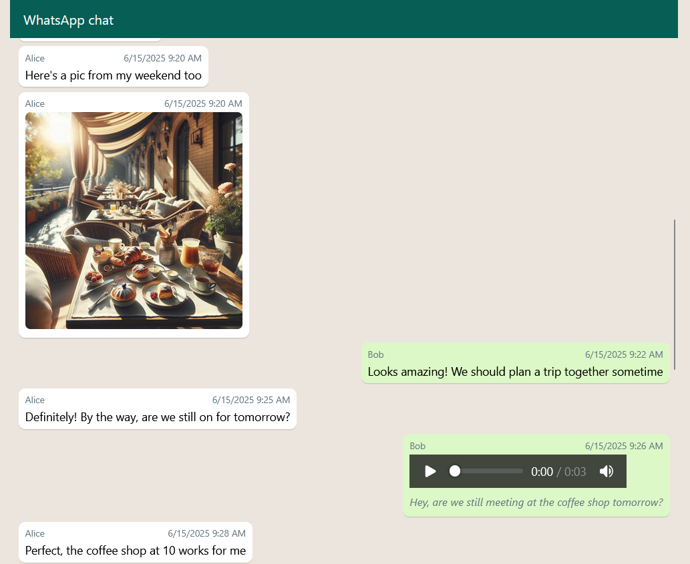

# WhatsApp Chat Viewer

WhatsApp's built-in chat export produces a plain text file and a folder of loose media files, which is hard to read and navigate. This tool generates a clean, browsable HTML page from that export, with embedded images, videos, audio players, PDFs, and optional audio transcription.



## Setup

```
pip install -r requirements.txt
```

For audio transcription, set your OpenAI API key:

```
# Linux/macOS
export OPENAI_API_KEY="sk-..."

# Windows
setx OPENAI_API_KEY "sk-..."
```

## Usage

### Basic

```
python whatsapp_viewer.py --dir "path/to/chat/folder"
```

This expects a `chat.txt` file and media files inside the folder, and generates `output.html` there.

### Custom file names

```
python whatsapp_viewer.py "my_chat.txt" --dir "path/to/folder" --me "YourName"
```

The `--me` flag aligns your messages to the right.

### Audio transcription

Transcribe all audio files using OpenAI's speech-to-text API:

```
python whatsapp_viewer.py "chat.txt" --dir "path/to/folder" --transcribe
```

Transcribe only the first N audios (useful for testing):

```
python whatsapp_viewer.py "chat.txt" --dir "path/to/folder" --transcribe --transcribe-only-x-audios 5
```

Transcriptions are cached as `.original.txt` files next to each audio file. Re-running the command skips already-transcribed audios.

### Transcription correction

Correct transcriptions using an LLM with conversation context:

```
python whatsapp_viewer.py "chat.txt" --dir "path/to/folder" --correct
```

Interactive mode lets you review each correction (accept, reject, or edit):

```
python whatsapp_viewer.py "chat.txt" --dir "path/to/folder" --correct-interactive --transcribe-only-x-audios 10
```

Corrected transcriptions are saved as `.txt` files. The original `.original.txt` files are preserved. The HTML output uses corrected versions when available.

### All options

| Argument | Description |
|---|---|
| `chat_txt` | Chat text file (default: `chat.txt`) |
| `media_dir` | Media directory (default: `.`) |
| `output_html` | Output HTML file (default: `output.html`) |
| `--dir DIR` | Base directory for all files |
| `--me NAME` | Your name in the chat (right-aligns your messages) |
| `--transcribe` | Transcribe audio files using OpenAI API |
| `--transcribe-only-x-audios N` | Limit to first N audios |
| `--stt-model MODEL` | Speech-to-text model (default: `gpt-4o-mini-transcribe`) |
| `--correct` | Correct transcriptions using LLM with conversation context |
| `--correct-interactive` | Interactively review each correction |
| `--llm-model MODEL` | LLM model for correction (default: `gpt-4o-mini`) |

## Demo

A [`sample/`](sample/) directory is included with a short conversation between two fictional users, AI-generated images, audio files, and pre-generated transcriptions.

To generate the HTML yourself:

```
python whatsapp_viewer.py --dir sample --me Bob
```

Or browse the pre-generated output directly (live rendered):

- [With transcriptions](https://rodrigodesalvobraz.github.io/whatsapp-chat-viewer/sample/output.html)
- [Without transcriptions](https://rodrigodesalvobraz.github.io/whatsapp-chat-viewer/sample/output-without-transcription.html)
